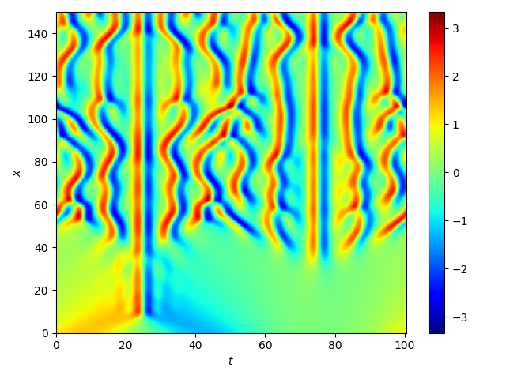

# Fourier Transform.

In November 2023, I implemented a code to solve Kuramoto-Sivashinsky equation with Fourier pseudo-spectral method.
That was really fun, since the code was really fast, easy to read, and producing realistic plots. 

At first, I was little confused about definitions of Fourier transform which was taught in real analysis course and discrete Fourier transform, a discrete algorithm for Fourier transform.
In this short article, we'll remove the confusion via intuitive explanation.

Let's start from the most general definition.
Let $f \in L^1(\mathbb{R})$.
Then its Fourier transform is defined by
$$\hat{f}(\xi) = \int_\mathbb{R} f(x)e^{-i 2 \pi \xi x} dx.$$
The inverse transform defined by
$$\int_\mathbb{R} \hat{f}(\xi) e^{i 2 \pi \xi x } d\xi \rightarrow f$$
converges to $f$ in $L^2$ sense.
This provides a lot of convenient tools for analysis, yet hard to compute, since the domain is infinite.

Let's move back to periodic domain.
Let $f: (0, P] \rightarrow \mathbb{R}$ be a periodic function, where $P$ is the period.
First define an inner product:
$$(f, g) := \frac{1}{P}\int_0^P f(x)\bar{g}(x)dx.$$
Equipped with this inner product, 
$$\{\phi_k : x\mapsto e^{i\frac{2\pi k}{P}x}\}_{k\in \mathbb{Z}}$$
forms an orthonormal basis.
In this setup, Fourier transform can be understood as taking coefficients for the Fourier basis, and inverse Fourier transform corresponds to reconstruction.
That is,
$$\hat{f}(k) : = (f, \phi_k),$$
and
$$\sum_{k\in \mathbb{Z}} \hat{f}(k)\phi_k \rightarrow f$$
in $L^2$ sense.

Now we need to obtain numerical values for these transformations.
If we know the Fourier coefficients, the reconstruction is stratightfoward: truncate $k$ suitably.
To obtain the coefficients, numerical computations are necessary.
Since the domain is periodic, the rectangular quadrature rule ($=$ Trapezoidal Rule) is optimal.
Let us divide the domain $(0, P]$ by $x_i = \frac{Pi}{N}$.
Then the numerical integration is
$$\hat{f}(k) = (f, \phi_k) \approx \frac{1}{N}\sum_{i=1}^N f(x_i) e^{-i\frac{2\pi k}{P}x_i}.$$
In convention, we usually put the scaling factor $\frac{1}{N}$ to reconstruction (inverse Fourier transform), not to projection (Fourier transform).

How many values of $k$ should we use?
The above formula let us use any values of $k$.
Recall that $e^{i\theta} = \cos(\theta) + i\sin(\theta)$.
This means that for large values of $k$, $\phi_k$ highly oscillates.
Then the above integral becomes inaccurate, and we need more $N$.
Thus, in convenction, we use $k = -N/2 + 1, \dots, N/2$ if $N$ is even, and $-(N-1)/2, \dots, (N-1)/2$ if $N$ is odd.
Let's denote these set of $k$ values by ${\bf k}_N$.
In fact, this is related to "Nyquist frequency", but I don't know the exact detail.
With this in mind, now we define the Discrete Fourier Transform:
$$\hat{f}(k) = (f, \phi_k) \approx \frac{1}{N}\sum_{i=1}^N f(x_i) e^{-i\frac{2\pi k}{P}x_i}, k \in {\bf k}_N.$$
In numerical computational viewpoint, this is a matrix-vector multiplication.
The vector is ${\bf f} = [f(x_1), \dots, f(x_N)]^T$ and the matrix is $(F)_{ki} = \phi_k(x_i)$.
That is, 
$$[\hat{f}(k_1), \dots, \hat{f}(k_N)]^T = F {\bf f}.$$
Thus the numerical evaluation requires $O(N^2)$ multiplication.
However, by exploitting symmetry, Cooley & Tucky developed Fast Fourier Transform (FFT), which only requires $O(N\log N)$ computational complexity.
This is very cool for high dimensions.